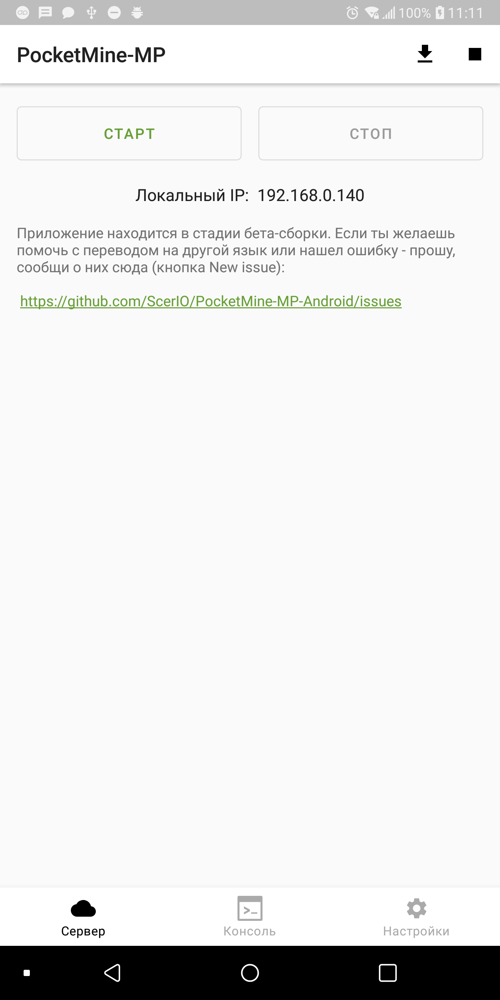
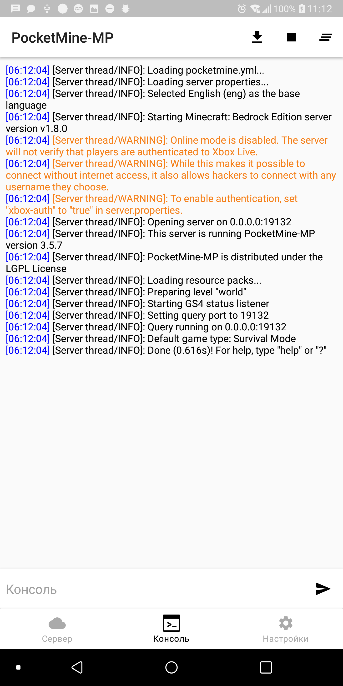
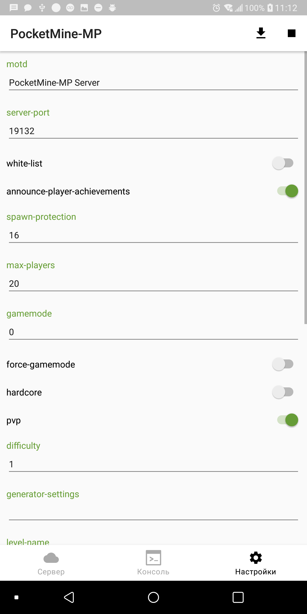

# PocketMine-MP-Android
PocketMine-MP server management for Android

This program allows you to run PocketMine-MP server on your android device using PHP (Works only on abi `arm64`)

## Download

## Screenshots

    
    
    

